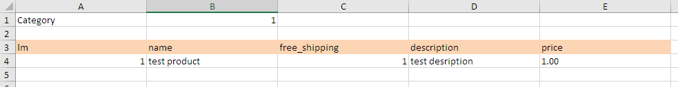

# Catalog API

REST API to insert and manage products in a catalog. It processes inserted spreadsheets in a background service, feed by a queue.

Tools applied to the project:

- ASP.NET Core (.NET 5)
- ASP.NET Core Worker
- MongoDB
- Azure Blob Storage
- Azure Storage Queue
- Open API
- Docker Compose

## Endpoints

### POST api/files/upload

Send spreadsheet via *form-data* interface. API returns file data and File Id, used to get processing status.

The image downwards shows the spreadsheet template:

 

### GET api/files/upload/status/{fileId}

It allows to get file data and Status, passing the *file id* obtained in the upload endpoint. The possible statuses are: "Uploaded", "Processed", "Invalid File".

### GET api/products

Get products inserted via upload.

### PUT api/products{lm}

Edit product inserted via upload, passing *lm* property (id).

### DELETE api/products{lm}

Remove product inserted via upload, passing *lm* property (id).

##### Documentação detalhada: https://documenter.getpostman.com/view/8706801/TzsfoRDH
